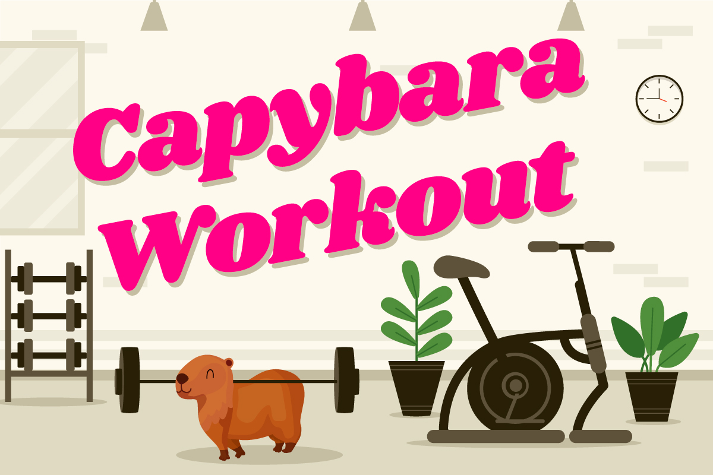

# Capybara Workout



## Running locally

Choose between:
```bash
    rackup # runs on http://localhost:9292/
    # or
    ruby app/app.rb # runs on http://localhost:4567
```

This will bring you to the instructions for interacting with the app. Then once you have IRB working with Capybara and you're ready to start the activity:

```bash
    visit('http://localhost:<port>/workout')
```

## Development

To run tests, I recommend installing [chromedriver](https://formulae.brew.sh/cask/chromedriver):

```bash
brew install --cask chromedriver
```

To contribute to CSS, please use Sass. You can install Dart Sass by running:

```bash
brew install sass/sass/sass
```

and then run the following watch command to automagically compile your changes down to CSS:

```bash
sass --watch app/public/stylesheets/scss/capybara-style.scss:app/public/stylesheets/css/capybara-style.css
```

## Notes

In the instructions to prepare `IRB` for the session, the user is asked to run:

```ruby
extend Capybara::DSL
```

Previously this was an `include` statement, but this was crashing `IRB`, forcing users to use [`PRY`](https://github.com/pry/pry) as a workaround. Not the end of the world, but an extra step which added more confusion for students already grappling with a lot of new concepts.

---

### Credits

This app is heavily based on a concept created by ex-Makers student and coach, [Ptolemy Barnes.](https://github.com/ptolemybarnes/capybara-workout) We all owe you a debt of gratitude for such a wonderful educational concept.

Capybara workout was lovingly restored by [Roi Driscoll](https://github.com/oceansize) in early 2022.